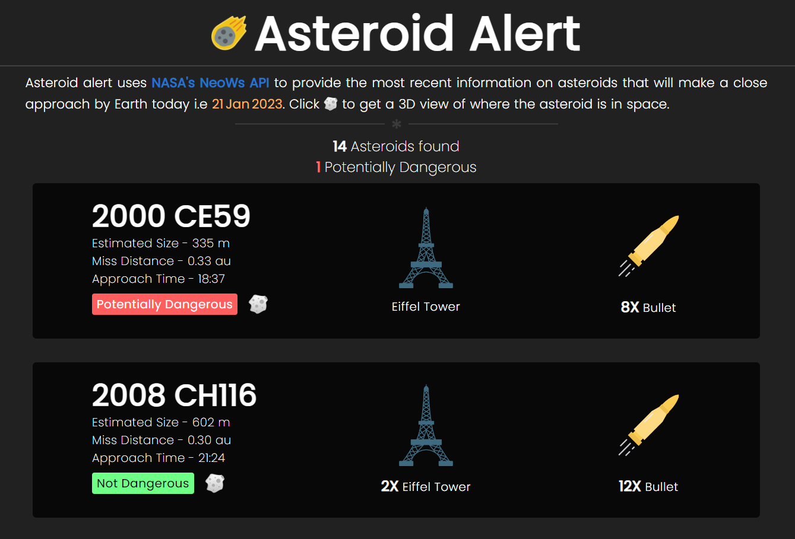

# Asteroid Alert
Look what **Asteroids** are going to make a close approach by **Earth** today. 
Check out the site here - [https://asteroidalert.netlify.app](https://asteroidalert.netlify.app)
#

## About 👀
The app gets the data from [NASA's NeoWs API](https://api.nasa.gov) and displays it in an easy-to-read format. It shows important information about each asteroid such as its **size**, **speed**, and **miss-distance** from Earth. It also compares the size of an asteroid to objects such as an **Aeroplane** or **The Eiffel Tower** to provide a perspective on how big an asteroid is.  
> ⚠️ The data provided by NASA's API is the most recent and not real-time. 

## Tech 🛠️
Built using Vanilla JS and [spacekit](https://typpo.github.io/spacekit/) library to create the 3D interactive space visualizations.  
Uses [localStorage](https://developer.mozilla.org/en-US/docs/Web/API/Window/localStorage) to store the data locally in your browser, so that it can be accessed faster and without the need to fetch it from the API again. This improves the performance and reduces the number of requests made to the API. 
 
> Images provided by - [Flaticon](https://www.flaticon.com/)